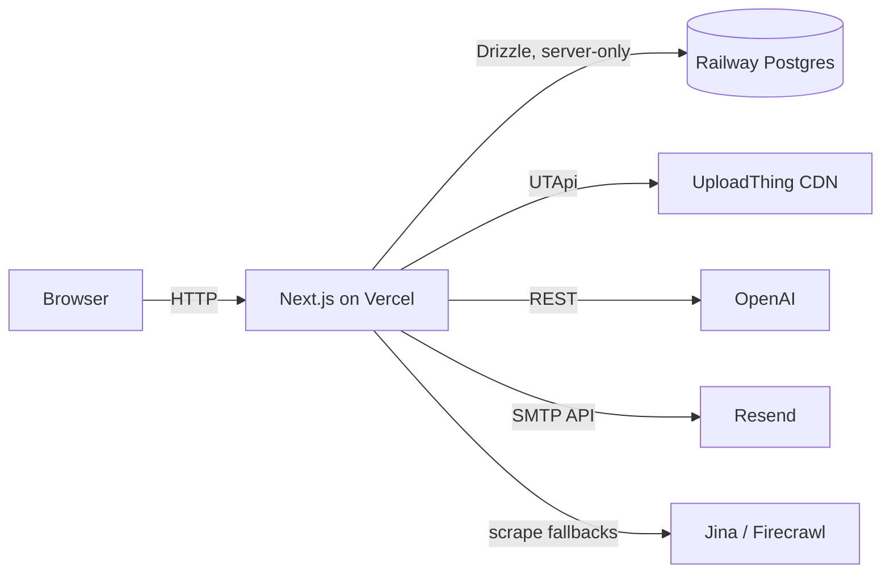

# Architecture

> Living document; updated by every PR that changes structure. Current as of Phase 4 (My list).

## Layout

```
src/
  app/          App Router: (list)/ my list · wishes/new · wishes/[id](+/edit)
                · archive · people · profile · login · welcome · api/*
  components/   Shared UI components
  i18n/         next-intl config: locale detection, server actions
  lib/          Business logic & utilities (theme, later: db, storage, parsing)
  styles/       tokens.css — Paper Ledger design tokens (light + dark)
  test/         Vitest setup
messages/       i18n catalogs: ru.json, en.json (keys must match — enforced by test)
design/         Claude Design mockups (reference only, excluded from lint)
docs/wiki/      Source of truth for this wiki (synced on merge to main)
```

## Key decisions

- **`src/` directory** with `@/*` import alias.
- **Design tokens as CSS variables** (`src/styles/tokens.css`), mapped to Tailwind v4 utilities via `@theme inline` in `globals.css`. Light values are verbatim from `design/uploads/tokens.css`; dark ("night ledger") is authored in code — the mockups only documented its palette. Radius is `0` everywhere except avatars/dots (hard design rule).
- **Fonts** via `next/font/google`: Newsreader (Latin serif) → Literata (Cyrillic serif fallback — Newsreader has no Cyrillic) → Georgia; Inter for UI; JetBrains Mono for numbers/meta.
- **Theme switching**: `data-theme` attribute on `<html>` (`light` / `dark` / `system`), persisted in `localStorage`, applied by an inline no-flash script in `layout.tsx`. `system` follows `prefers-color-scheme` via CSS.
- **i18n**: next-intl **without locale routing** — locale lives in a cookie (`wishka-locale`), defaults to the browser language, switched via a server action. No `/ru`/`/en` URL prefixes.
- **Database will be server-only** (Phase 2): the client never queries Postgres directly; privacy rules (reservations invisible to list owners, per-wish visibility) are enforced in the data-access layer and covered by tests.

## Diagram


